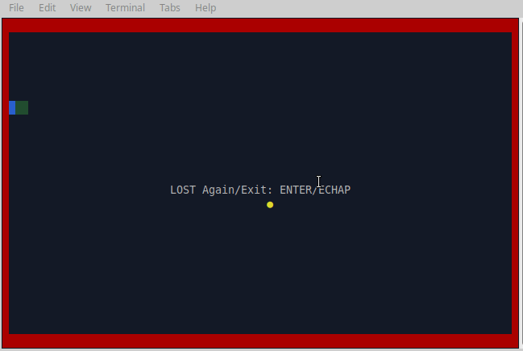

# 🐍 Terminal Snake Game (Rust + Crossterm)

This is a simple Snake game implemented in Rust using the crossterm library for cross-platform terminal manipulation.



--- 
## 📦 Project Structure
```
├── Cargo.lock
├── Cargo.toml
├── LICENSE
└── src
    ├── main.rs       // Game loop and input handling
    ├── scene.rs      // Terminal rendering and game scene management
    └── snake.rs      // Snake logic and movement
```
---
## ▶️ How to Run

1. **Install Rust**: [https://rustup.rs](https://rustup.rs)
2. **Clone the repo** and run the game:

```bash
git clone https://github.com/LucasCodingM/snake-rust.git
cd snake-rust
cargo run
```
## 🎮 Controls

    Arrow keys: Control the snake

    Space: Pause / Resume the game

    Enter: Restart the game (after losing)

    Esc: Quit the game

🛠 Features

    Terminal-based gameplay with raw mode and alternate screen

    Snake movement and growth

    Random fruit spawning

    Collision detection (walls & self)

    Game over and restart functionality

📝 License

This project is licensed under the MIT License.
